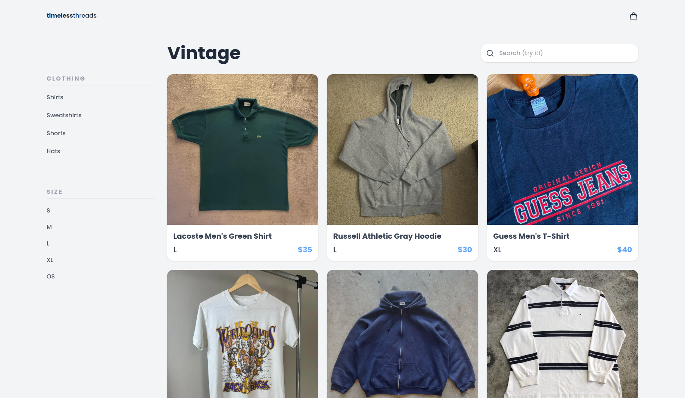

    </img>
    

    <h2 style="font-weight: bold">eCommerce Store</h2>
    

* Utilized Static Generation and Next.js fetch options to generate iterative pages for over 20+ products.
* Developed search and filter options with functional components to find any product in under 1 second.

The live site is at [minimalist-ecommerce-store.vercel.app/](https://minimalist-ecommerce-store.vercel.app/) 